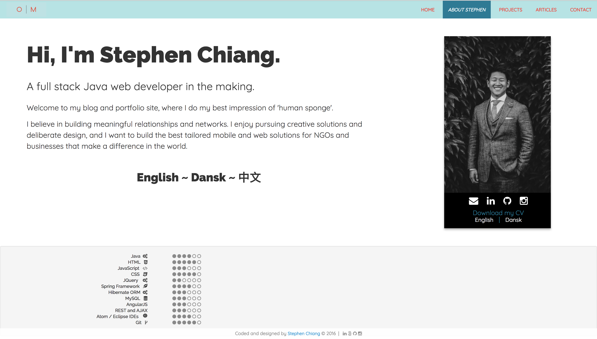
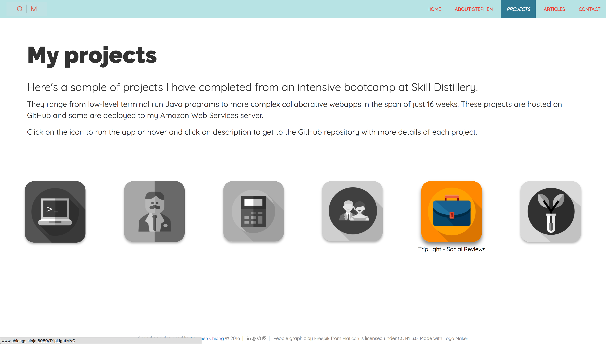

# Welcome to my personal portfolio project!
This is an ongoing project that will continue to develop. It's purpose it to showcase the growth and learning I've achieved while going through Skill Distillery's Full Stack Java Web Programming Bootcamp and beyond.

## In This Repository:
1. <&nbsp;> HTML files
2. {&nbsp;&nbsp;} CSS / Javascript files
3. CV in English / Dansk

## How to view site:
1. Navigate to [https://chiangs.github.io/](**https://chiangs.github.io/**).
2. Click on the link above next to **Portfolio Project**.

## Getting in touch with me:
* [LinkedIn](http://www.linkedin.com/in/chiangs)
* [Email](mailto:stephen.e.chiang@gmail.com)
* [Portfolio Site](http://www.chiangs.ninja)
